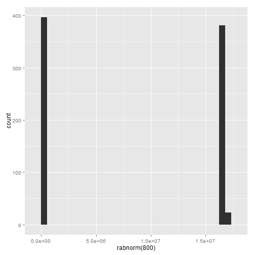

A Non-Normal Life 

By: "The Gang"
========================================================

In the beginning, there was probability. Well, there probably was. There were all sorts of distributions of all different sorts, and it was wonderful.
\#distri


=======
All of the distributions lived in perfect harmony.


Until one day, a new distribution appeared... and ABnormal distribution


```r
rabnorm <- function(n, mean = 0, sd = 1, useless = "0xFFFFFF") {
    return(rcauchy(n)%%as.numeric(useless))
}
qplot(rabnorm(800), geom = "histogram")
```

 


```r
`(` = function(x) {
    return(x * runif(1) * rgamma(1, 1, 1))
}

for (i in 1:5) {
    print(5 * (3 + 4))
}
```

```
## [1] 13.23
## [1] 18.16
## [1] 6.865
## [1] 3.224
## [1] 23.11
```


Who needs to be normal anyways???? If everyone was normal there would have never been


You see that??? Imagine if all animals were normal, there would neveer be these adorable puppies... OR


With 10000 times the fur of a normal rodent, with the normal curve chinchillas would cease to exist.


```r
`+` = function(x, y) {
    paste0(x, y, "1939")
}
print(5 + 6)
```

```
## [1] "561939"
```


The Abnormal distribution wandered around the internet, making changes to .Rmd files all over the place. Sometimes, if you're lucky, you'll come across a .Rmd file that literally makes no sense. It will contain pictures and R code that don't seem to fit with anything else in the document. 


The End. 


